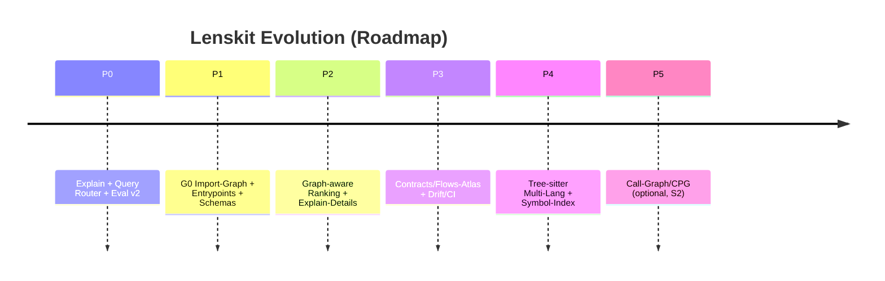

# Lenskit als Repository-Kognition-Engine: Roadmap, Contracts und Graph-Index

## Executive Summary

**These.** Lenskit ist bereits mehr als „Repo-Dump“: Es produziert kanonische, deterministische Artefakte (Markdown als Wahrheit, JSON als Navigation, plus Retrieval-Index) und hat damit die entscheidende Voraussetzung für maschinelles Verstehen erfüllt: *reproduzierbare, contract-beschriebene Outputs* mit Provenienz (Hashes, Manifest). fileciteturn47file2L1-L1 fileciteturn36file2L1-L1

**Antithese.** Jede Retrieval-/Graph-Schicht kann epistemische Blindheit erzeugen: Text-Retrieval (BM25) bevorzugt sprachliche Oberflächen; ein Import-Graph bevorzugt statische Kopplung; Entrypoints bevorzugen „offizielle“ Pfade; Tests und Tools können Kanten verzerren. Ohne Evidenzlabel („wie sicher ist diese Kante?“) wird die Architekturkarte zur Scheinpräzision, insbesondere weil Entwicklungszeit- und Laufzeitaspekte leicht vermischt werden (klassischer Fehler). citeturn12view0 citeturn19view0

**Synthese.** Lenskit wird „10ד nicht durch schönere Zusammenfassungen, sondern durch ein **mehrschichtiges, evidenzmarkiertes Architekturmodell**, das *aus bestehenden Artefakten* reproduzierbar abgeleitet, per JSON-Schema validiert und im Retrieval direkt verwertet wird:  
- **S0 (belegt):** Struktur, Entrypoints, deklarative Abhängigkeiten, Artefakt-/Contract-Flüsse  
- **S1 (hoch plausibel):** Import-Graph, CLI-Kommandokette, statische Wiring-Heuristiken  
- **S2 (spekulativ):** Laufzeitpfade/Hotspots (nur mit Logs/Tracing) citeturn12view0 citeturn19view0

**Alternative Sinnachse (Zielannahme kippen).** Wenn das Ziel nicht „Code finden“, sondern „System steuerbar machen“ ist, wird der *Contracts/Flows-Atlas* (Produzenten/Consumer von Artefakten, CI-Checks, Drift-Regeln) zum primären Graph – und der Import-Graph nur sekundäre Evidenz. Das ist weniger „IDE-Suche“, mehr „Leitstand“. (Beide Pfade sind kompatibel; sie denken nur anders.)

**Priorität in einem Satz.** Baue zuerst **G0: Python-Import-Graph + Entrypoints + typed edges + Evidenzlabel + Explain**, und erst danach Call-Graph/CPG, weil der Grenznutzen von S1→S2 stark fällt, während das Bias-Risiko steigt. citeturn18view0 citeturn17view0

**Unsicherheitsgrad (0–1): 0,34.** Ursachen: (i) keine echte Ausführung auf produktiven Ziel-Repos hier, (ii) Sprachmix/Monorepo-Realität unbekannt, (iii) aktuelle Recall-Baselines nur aus Query-Set ableitbar, nicht aus Nutzer-Tasks.  
**Interpolationsgrad (0–1): 0,28.** Hauptannahmen: (i) chunk_index deckt relevanten Code zuverlässig ab, (ii) Import-Kanten liefern brauchbare Nähe-Signale, (iii) EntryPoints sind statisch auffindbar.

## Ist-Zustand im Repo

### Was heute vorhanden ist

Lenskit hat bereits eine klar erkennbare Pipeline aus **Truth Layer → Retrieval Layer → Interface Layer** (inkl. „Manifest Policy“, Staleness-Check und optionaler semantischer Re-Ranking-Policy). Das ist in den Retrieval-Dokumenten und Rezepten explizit beschrieben. fileciteturn40file1L1-L1 fileciteturn40file0L1-L1 fileciteturn41file2L1-L1

Im Code existieren die Kernbausteine:
- Merge/Artefakt-Erzeugung (inkl. dump_index/derived/bundle manifest) fileciteturn47file2L1-L1  
- Chunker (aktuell line-/size-basiert, ohne echte semantische Boundaries) fileciteturn43file2L1-L1  
- SQLite/FTS5 Indexschema + Query-Core fileciteturn35file2L1-L1 fileciteturn35file0L1-L1  
- Range-Resolver (extract-bytes aus Artefakten über range_ref) fileciteturn36file0L1-L1  
- Retrieval-Eval (Queries + Recall@k) fileciteturn34file1L1-L1 fileciteturn39file0L1-L1

Die Contracts sind nicht „Deko“, sondern operational: `bundle-manifest` und `range-ref` sind bereits schema-definiert und getestet. fileciteturn36file2L1-L1 fileciteturn38file0L1-L1

### Aktuelle CLI-Fläche

Die CLI ist modular (Subcommands u.a. `index`, `query`, `eval`, `range get`) und hat bereits Staleness-Policy-Hooks. Das erleichtert die Einführung eines `architecture`-Commands und eines `--explain`-Flags ohne Bruch. fileciteturn40file4L1-L1 fileciteturn40file2L1-L1

### Wo die aktuelle Retrieval-Implementierung Bias erzeugt

Lenskit nutzt FTS5/BM25 (SQLite) – das ist robust, replizierbar, aber textzentriert. FTS5 interpretiert Whitespace als **implizites AND** und bietet OR/NOT/Spaltenscopes; ohne Query-Router/Synonyme werden viele Entwicklerfragen „zu eng“ gematcht. citeturn11search0 citeturn11search1

Das ist kein Fehler – es ist eine Eigenschaft. Der Bias ist nur dann unangenehm, wenn Lenskit *seine eigene Unsicherheit nicht ausweist* (z.B. „kein Treffer“ ≠ „existiert nicht“). Lenskit adressiert das als epistemische Warnung bereits im Merge-Konzept; dasselbe Prinzip muss für Graph-/Entrypoint-Sichten gelten. fileciteturn44file0L1-L1 citeturn12view0

## Roadmap in Phasen

### Quellengewichtung für die Roadmap

- **Systemtiefe/Primärnähe:** SQLite-FTS5-Referenz, ISO 42010, Python-AST-Doku, Tree-sitter-Doku, CPG-Paper (primär, methodisch, replizierbar). citeturn11search0 citeturn19view0 citeturn16view0 citeturn17view0 citeturn18view0  
- **Praxisrahmen (deutsch, systemisch):** Fraunhofer IESE zu Sichten/Runtime-vs-Devtime und „Architekturtapete“-Risiko; arc42 als praxiserprobtes Dokumentations-Template. citeturn12view0 citeturn15view1  
- **Sicherheits-/Formalisierungsblick:** BSI-Leitfäden als Reminder, dass formalisiertes Modellieren Nutzen hat, aber auch Prüf-/Akzeptanzprozesse braucht. citeturn14search0 citeturn14search5

### Phasenübersicht nach Impact/Risiko

Die erwarteten Recall-Gewinne sind **plausible** Schätzungen (nicht belegt), weil die reale Nutzer-Query-Verteilung fehlt.

| Phase | Kernziel | Erwarteter Retrieval-Gewinn | Haupt-Risiko | Aufwand (PT) |
|---|---|---:|---|---:|
| P0 | Retrieval „ehrlich & debugbar“ (Explain, Query Router, Eval v2) | mittel | Overmatching / falsche Sicherheit | 4–7 |
| P1 | **G0 Graph-Index**: Python Import-Graph + Entrypoints + Evidenzlabel S0/S1 | groß (für Strukturfragen) | Scheinpräzision, Tests verzerren | 7–12 |
| P2 | Graph-aware Scoring: BM25 + Nähe + Entrypoint-Dist + Test-Penalty | groß | Tuning/Tradeoffs | 6–10 |
| P3 | Contracts/Flows-Atlas (Alternative Achse) + CI/Drift Regeln | mittel | Governance-Overhead | 4–8 |
| P4 | Multi-Lang Parsing (Tree-sitter) + Symbol-Index v2 | mittel–groß | Parser-Wartung | 10–18 |
| P5 | Call-Graph/CPG v2 (S2) | selektiv sehr groß | falsch-positive Pfade | 15–30 |

Mermaid-Timeline (implementierbar als PR-Reihe, nicht als Mega-PR):



### Konkrete Tasks pro Phase (Dateien, CLI, Tests, CI)

#### Phase P0: Retrieval „ehrlich & debugbar“

**Tasks**
- `lenskit query --explain`: Ausgabe von Tokenisierung, finaler FTS-Query, BM25/rank, Filter, Result-Metadaten. (Erweitert `cmd_query.py` und `query_core.py`.) fileciteturn35file0L1-L1
- Query Router (minimal): Synonym-/Intent-Normalisierung (konfigurierbar), OR-Expansion, path_tokens-Feldung.  
- Eval v2: per Kategorie Recall@5/10, plus „coverage“ (wie viele Queries sind repo-spezifisch vs generisch). Queries liegen bereits als JSON vor. fileciteturn34file2L1-L1
- CI: Golden Tests für Explain-Output und Query-Rewrite.

**Warum jetzt?** SQLite-FTS5 hat klare Syntax (AND/OR, Spaltenfilter, rank/bm25). Lenskit nutzt das schon – P0 macht es nur *kontrollierbar* und *auditierbar*. citeturn11search0 citeturn11search1

#### Phase P1: Minimaler Graph-Index G0 (Python Import-Graph) + Entrypoints

**Tasks**
- Neues Artefakt `architecture.graph.json` (S0/S1 Edges) + `entrypoints.json`.
- Generator nutzt **chunk_index.jsonl** als Rohstoff (kein Repo-Checkout nötig): Import-Statements lassen sich aus Chunk-Text ziehen; AST-Knoten `Import`/`ImportFrom` liefern strukturierte Daten. citeturn16view0  
- Contract-first: JSON-Schemas + CI-Validator.
- CLI: `lenskit architecture` erzeugt Graph-Artefakte aus bestehendem Bundle (oder direkt aus chunk_index).  
- CI: deterministische Output-Ordnung, Golden Tests, Cycle-Detection Test.

**Warum plausibel wirksam?** Architekturfragen („wo startet indexing?“) sind häufig **strukturell**; ein Import-/Entrypoint-Graph liefert Nähe-Signale, die reiner Text nicht hat – ohne gleich in Call-Graph-S2 zu gehen. Fraunhofer IESE warnt explizit vor Vermischung von Runtime/Devtime – genau deshalb wird G0 als Devtime-Sicht (S1) gelabelt. citeturn12view0

#### Phase P2: Retrieval-Ranking mit Graph-Nähe

**Tasks**
- `graph_index.json` als kompakter, retrieval-optimierter Index (adjacency + vorberechnete Distanzen zu Entrypoints + node_id pro file).
- SQLite-Index optional erweitern (non-breaking): zusätzliche Tabellen `graph_node`, `graph_edge`, `chunk_features` (oder JSON sidecar).  
- Query Pipeline: BM25 topN → Graph feature rerank → Explain erweitert.

#### Phase P3: Contracts/Flows-Atlas (Alternative Achse)

**Tasks**
- `contracts.graph.json`: Nodes = Artefakte/Contracts, Edges = Producer/Consumer (z.B. merge → dump-index → index → eval).  
- CI: Contract-Drift-Regeln (z.B. „neue ArtifactRole ohne Schema verboten“), plus „stale graph“ via canonical_dump_hash.

#### Phase P4/P5: Multi-Lang + Symbol/Call Graph (optional, risikoreicher)

Tree-sitter ist ein robuster, inkrementeller Parser für viele Sprachen und kann Syntaxbäume auch bei Fehlern sinnvoll liefern – ideal für „Symbol Index“ über Sprache hinweg. citeturn17view0  
Ein Code Property Graph (CPG) vereint AST+CFG+PDG in einer Datenstruktur und ist mächtig, aber klar S2/S3 in Komplexität; er lohnt sich, wenn du Security-/Dataflow-Fragen wirklich beantworten willst. citeturn18view0

## Artefakte und Contracts

### Evidenzlevel S0/S1/S2 als Pflichtfeld

Evidenzlevel ist kein „Nice to have“, sondern der zentrale Bias-Guard: Import-Graph ≠ Laufzeitgraph. ISO 42010 betont explizit „viewpoints, frameworks, description languages“ als Konventionen und required content von Architektur-Beschreibungen – das ist die normative Grundlage für *mehrere Schichten* statt einer Karte. citeturn19view0 citeturn12view0

### Schema: architecture.graph.v1

```json
{
  "$schema": "http://json-schema.org/draft-07/schema#",
  "$id": "https://heimgewebe.local/schema/architecture.graph.v1.schema.json",
  "title": "Architecture Graph (architecture.graph v1)",
  "type": "object",
  "additionalProperties": false,
  "required": ["kind", "version", "run_id", "canonical_dump_index_sha256", "nodes", "edges", "coverage"],
  "properties": {
    "kind": { "const": "lenskit.architecture.graph" },
    "version": { "const": "1.0" },
    "run_id": { "type": "string" },
    "canonical_dump_index_sha256": { "type": "string", "pattern": "^[a-f0-9]{64}$" },
    "generated_at": { "type": "string" },
    "granularity": { "type": "string", "enum": ["file", "package", "module"] },
    "nodes": {
      "type": "array",
      "items": {
        "type": "object",
        "additionalProperties": false,
        "required": ["node_id", "kind", "path", "repo", "is_test"],
        "properties": {
          "node_id": { "type": "string" },
          "kind": { "type": "string", "enum": ["file", "package", "module", "external"] },
          "path": { "type": "string" },
          "repo": { "type": "string" },
          "language": { "type": "string" },
          "layer": { "type": "string" },
          "is_test": { "type": "boolean" },
          "size_bytes": { "type": "integer", "minimum": 0 }
        }
      }
    },
    "edges": {
      "type": "array",
      "items": {
        "type": "object",
        "additionalProperties": false,
        "required": ["src", "dst", "edge_type", "evidence", "evidence_level"],
        "properties": {
          "src": { "type": "string" },
          "dst": { "type": "string" },
          "edge_type": { "type": "string", "enum": ["import", "require", "config-link", "string-ref", "call-heuristic"] },
          "evidence_level": { "type": "string", "enum": ["S0", "S1", "S2"] },
          "evidence": {
            "type": "object",
            "additionalProperties": false,
            "required": ["source_path"],
            "properties": {
              "source_path": { "type": "string" },
              "start_line": { "type": "integer", "minimum": 1 },
              "end_line": { "type": "integer", "minimum": 1 },
              "extract": { "type": "string", "maxLength": 240 }
            }
          }
        }
      }
    },
    "coverage": {
      "type": "object",
      "additionalProperties": false,
      "required": ["files_seen", "files_parsed", "edge_counts_by_type", "unknown_layer_share"],
      "properties": {
        "files_seen": { "type": "integer", "minimum": 0 },
        "files_parsed": { "type": "integer", "minimum": 0 },
        "edge_counts_by_type": { "type": "object" },
        "unknown_layer_share": { "type": "number", "minimum": 0, "maximum": 1 }
      }
    }
  }
}
```

### Schema: entrypoints.v1

```json
{
  "$schema": "http://json-schema.org/draft-07/schema#",
  "$id": "https://heimgewebe.local/schema/entrypoints.v1.schema.json",
  "title": "Entrypoints (entrypoints v1)",
  "type": "object",
  "additionalProperties": false,
  "required": ["kind", "version", "run_id", "canonical_dump_index_sha256", "entrypoints"],
  "properties": {
    "kind": { "const": "lenskit.entrypoints" },
    "version": { "const": "1.0" },
    "run_id": { "type": "string" },
    "canonical_dump_index_sha256": { "type": "string", "pattern": "^[a-f0-9]{64}$" },
    "entrypoints": {
      "type": "array",
      "items": {
        "type": "object",
        "additionalProperties": false,
        "required": ["id", "type", "path", "evidence_level"],
        "properties": {
          "id": { "type": "string" },
          "type": { "type": "string", "enum": ["cli", "module_main", "web", "worker", "test"] },
          "path": { "type": "string" },
          "symbol": { "type": "string" },
          "evidence_level": { "type": "string", "enum": ["S0", "S1", "S2"] },
          "evidence": { "type": "object" }
        }
      }
    }
  }
}
```

### Schema: contracts.graph.v1 (Alternative Achse)

```json
{
  "$schema": "http://json-schema.org/draft-07/schema#",
  "$id": "https://heimgewebe.local/schema/contracts.graph.v1.schema.json",
  "title": "Contracts/Flows Graph (contracts.graph v1)",
  "type": "object",
  "additionalProperties": false,
  "required": ["kind", "version", "nodes", "edges"],
  "properties": {
    "kind": { "const": "lenskit.contracts.graph" },
    "version": { "const": "1.0" },
    "nodes": {
      "type": "array",
      "items": {
        "type": "object",
        "required": ["id", "kind"],
        "properties": {
          "id": { "type": "string" },
          "kind": { "type": "string", "enum": ["artifact", "contract", "command", "ci_check"] },
          "schema_id": { "type": "string" }
        }
      }
    },
    "edges": {
      "type": "array",
      "items": {
        "type": "object",
        "required": ["src", "dst", "edge_type", "evidence_level"],
        "properties": {
          "src": { "type": "string" },
          "dst": { "type": "string" },
          "edge_type": { "type": "string", "enum": ["produces", "consumes", "validates", "guards"] },
          "evidence_level": { "type": "string", "enum": ["S0", "S1", "S2"] }
        }
      }
    }
  }
}
```

### Chunk-Metadaten-Extension (kompatibel)

Lenskit hat bereits semantische Felder (`layer`, `section`, `concepts`) im chunk_index – die Erweiterung ist: **symbol_name**, **node_id**, **entrypoint_distance**, **is_test_penalty** (alle optional). fileciteturn43file2L1-L1 fileciteturn44file0L1-L1

Beispiel (ein Chunk):

```json
{
  "chunk_id": "a1b2c3d4e5f6...",
  "path": "merger/lenskit/retrieval/query_core.py",
  "repo": "lenskit",
  "language": "python",
  "start_line": 1,
  "end_line": 220,
  "content": "def execute_query(...): ...",
  "layer": "core",
  "symbol_name": "execute_query",
  "node_id": "file:merger/lenskit/retrieval/query_core.py",
  "entrypoint_distance": 2,
  "test_penalty": 0.8
}
```

### graph_index.json (Retrieval-optimiert)

```json
{
  "kind": "lenskit.graph_index",
  "version": "1.0",
  "run_id": "…",
  "canonical_dump_index_sha256": "…",
  "node_meta": {
    "file:merger/lenskit/retrieval/query_core.py": {
      "is_test": false,
      "layer": "cli",
      "fan_in": 7,
      "fan_out": 3,
      "min_entrypoint_distance": 1
    }
  },
  "adj": {
    "file:merger/lenskit/cli/main.py": ["file:merger/lenskit/cli/cmd_query.py"],
    "file:merger/lenskit/retrieval/query_core.py": ["external:sqlite3"]
  },
  "entrypoints": ["file:merger/lenskit/cli/main.py"],
  "metrics": {
    "nodes": 421,
    "edges": 1109,
    "cycles": 3
  }
}
```

## Build- und Query-Pipelines

### Pipeline und Provenienz

Lenskit nutzt bereits Hash-basierte Provenienz: Staleness wird über `canonical_dump_index_sha256` geprüft; der Stale-Check liest Hashes aus `derived_index.json` oder aus der SQLite Meta-Tabelle. fileciteturn40file2L1-L1

SQLite-FTS5 kann zusätzlich eine schnellere `rank`-Spalte statt `bm25()` verwenden; das ist ein Performance-Hebel für Explain und Rerank. citeturn11search0

Mermaid-Pipeline (Soll-Zustand ab P2):

```mermaid
flowchart LR
  Repo[Repo scan / merge] --> Dump[dump_index.json]
  Repo --> MD[canonical_md (.md parts)]
  Repo --> Chunks[chunk_index.jsonl]

  Dump -->|canonical_dump_index_sha256| Derived[derived_index.json]
  Chunks --> SQLite[(chunk_index.index.sqlite)]
  Derived --> SQLite

  Chunks --> Arch[architecture.graph.json]
  Chunks --> EP[entrypoints.json]
  Arch --> GIdx[graph_index.json]
  EP --> GIdx

  SQLite --> Query[lenskit query]
  GIdx --> Query
  Query --> Eval[retrieval_eval.json]
```

### Range_ref Integration: was fehlt und warum es wichtig ist

**Epistemische Leere:** *Es fehlt ein konsistenter „Byte-Range-Bezug“ zwischen Retrieval-Treffer (Chunk) und einem Artefaktpfad im Bundle.* Ohne das kannst du zwar Treffer listen, aber nicht deterministisch extrahieren/verifizieren (Proof-Carrying Retrieval).

**Was nötig ist für Y:**  
- X: „Chunk start/end bytes beziehen sich auf welches Artefakt?“  
- Y: `range_ref` in query-result, das der Range-Resolver tatsächlich akzeptiert (file_path muss artefakt-spezifisch sein). fileciteturn36file0L1-L1 fileciteturn38file0L1-L1 fileciteturn37file0L1-L1

**Implementierbarer Fix (P1/P2):**
1. Beim Schreiben des Merge-MD pro Datei die Byte-Offsets des Code-Blocks erfassen (Start-Byte des `content` im Markdown).  
2. Chunk offsets (`start_byte`, `end_byte`) in **Merge-MD-Offsets** transformieren: `md_start = file_content_md_offset + chunk.start_byte`.  
3. `chunk_index.jsonl` bekommt `range_ref` (oder `content_range_ref`) mit:
   - `artifact_role = "canonical_md"` **oder** `md_part`-role (bei Split)  
   - `file_path = <artefaktname>`  
   - `start_byte`, `end_byte`, `content_sha256`  
4. `lenskit query` kann dann `range_ref` in `query-result` wieder aktivieren.

Beispiel `range_ref` (neuer, bundle-konsistenter Stil):

```json
{
  "artifact_role": "canonical_md",
  "file_path": "lenskit-max-..._merge.md",
  "start_byte": 214998,
  "end_byte": 217441,
  "content_sha256": "…",
  "start_line": 1203,
  "end_line": 1321
}
```

## Retrieval-Integration und Explain

### Query Router und Ranking-Formel

**Prämissencheck (damit Ranking-Mix sinnvoll ist):**
- Es existiert ein Graph-Index (P1).  
- Entrypoints sind stabil auffindbar (mind. S0/S1).  
- Chunk-Metadaten enthalten `node_id` und `is_test`.  
Wenn eine Prämisse nicht erfüllt ist: fallback to BM25-only + Explain-Warnung.

**Ranking (kombiniert):**
- `bm25_norm`: normalisierte FTS5-Score (kleiner = besser; FTS5 dokumentiert Ranking/`rank`/`bm25`). citeturn11search0  
- `graph_proximity`: z.B. `1 / (1 + dist(node, query_anchor))`  
- `entrypoint_distance`: `1 / (1 + min_dist_to_entrypoint(node))`  
- `test_penalty`: Multiplikator < 1 für `tests/` und `_test.py`.

Formel (einfach, auditierbar):

```text
score = w_bm25 * bm25_norm
      + w_graph * graph_proximity
      + w_entry * entrypoint_boost
score = score * test_penalty
```

### FTS5 Query-Rewrites: OR-Expansion und Feldsuche

FTS5 unterstützt explizite `OR`/`AND`/`NOT` und implizites AND bei Whitespace; außerdem Spaltenfilter per `colname:`. citeturn11search0 citeturn11search1

**Beispiel 1: Synonym-OR in content (mit Klammern, sonst Präzedenz-Fallen):**

```sql
SELECT chunk_id, path, bm25(chunks_fts) AS score
FROM chunks_fts
WHERE chunks_fts MATCH '(auth OR login OR token OR credential) AND (merge OR merging)'
ORDER BY score
LIMIT 20;
```

**Beispiel 2: Feldsuche (content vs path_tokens):**

```sql
SELECT chunk_id, path, rank AS score
FROM chunks_fts
WHERE chunks_fts MATCH 'content:(index OR indexing OR build_index) AND path_tokens:(cli OR cmd OR main)'
ORDER BY score
LIMIT 20;
```

**Beispiel 3: Router-Output (explainbar)**
- Query: „where does indexing start“
- Router:
  - anchor_intent = `entrypoint`
  - terms = `(index OR indexing OR build_index)`
  - path_bias = `path_tokens:(cli OR cmd OR main)`
  - rerank = graph proximity to entrypoints

### Explain Output: Beispiel

```json
{
  "query": "where does indexing start",
  "router": {
    "intent": "entrypoint",
    "fts_query": "content:(index OR indexing OR build_index) AND path_tokens:(cli OR cmd OR main)",
    "synonyms_used": ["indexing", "build_index"]
  },
  "ranker": {
    "w_bm25": 0.65,
    "w_graph": 0.20,
    "w_entry": 0.15,
    "test_penalty_default": 0.75
  },
  "top_results": [
    {
      "path": "merger/lenskit/cli/main.py",
      "bm25": 1.23,
      "entrypoint_distance": 0,
      "graph_proximity": 0.91,
      "final_score": 0.12,
      "why": ["entrypoint_boost", "near_cli", "not_test"]
    }
  ]
}
```

## Bias-Guards, Drift, CI, Leitstand

### Resonanz- und Kontrastprüfung: zwei plausible Deutungen

**Deutung A (pro Graph):** Import-/Entrypoint-Graph reduziert systematisch die Blindheit textzentrierter Suche, weil Architekturfragen strukturelle Nähe brauchen. Er ergänzt FTS5, statt es zu ersetzen. (Resoniert mit „Sichten statt Architekturtapete“: mehrere Darstellungen mit klarer Aussage.) citeturn12view0

**Deutung B (contra Graph):** Der Graph wird zum Autoritätsanker („die Karte sagt…“) und verschiebt Aufmerksamkeit zu statisch gut sichtbaren Pfaden; dynamische Wiring, Konfiguration, Runtime-Polymorphie und IO-basierte Kopplungen verschwinden – der Nutzer wird selbstbewusst falsch. (ISO 42010 sagt sinngemäß: Viewpoints sind Konventionen; wer Konvention mit Wahrheit verwechselt, verliert.) citeturn19view0

**Synthese als Guardrail:** typed edges + Evidenzlevel + Coverage-Report + Explain sind nicht optional; sie sind das „Airbag-System“ der Karte.

### Drift Detection und CI-Regeln

**Metriken (S0/S1, messbar, replizierbar):**
- neue Zyklen / Cycle-Count (fail bei Δ>0 im core-Subgraph)
- Top fan-in/out (Warn bei neuem „God-node“)
- Anteil `unknown layer` (Warn/Fail ab Schwellwert)
- Test→Core-Kanten-Anteil (Warn bei Leak)
- Entrypoint-Reachability: Anteil Nodes erreichbar von `lenskit query` (Trend)

**CI-Regeln (contract-first):**
- Jede neue ArtifactRole braucht Schema + Beispiel + Test (sonst fail). (bundle-manifest ist schema-fest.) fileciteturn36file2L1-L1  
- `architecture.graph.json` muss deterministisch sortiert sein (Golden-Test).
- `canonical_dump_index_sha256` muss matchen, sonst „stale graph“ (fail/warn je Policy). fileciteturn40file2L1-L1

### Leitstand-Views (UI / menschliche Nutzung)

- **Entrypoint-zentrierte Ansicht:** „Alles, was von `lenskit query` erreichbar ist“ (Graph-Schnitt).  
- **Konflikt-Ansicht:** Imports sagen A→B, aber Contracts-Atlas sagt B konsumiert A (Inkonsistenz sichtbar machen).  
- **Epistemic HUD:** S0/S1/S2-Balken + „coverage“ + „unknown share“.

Humor, aber als Warnhinweis: Eine Architekturkarte ohne Evidenzlabel ist wie ein Stadtplan, der jede Straße „ungefähr hier“ einzeichnet – beeindruckend, bis du nachts im Regen den Bahnhof suchst. Dann wird aus Graph sehr schnell „Grafo-oh“. citeturn12view0

## Migration, Backward Compatibility und PR-Plan

### Backward-Compatibility Strategie

- **Additiv statt brechend:** neue Artefakte als zusätzliche roles; bestehende CLI/Outputs bleiben valid.  
- **Schema-Versionierung:** `architecture.graph.v1`, `entrypoints.v1`, `graph_index.v1`; keine Änderungen an `query-result.v1` ohne `v1.1` oder `v2`. fileciteturn37file0L1-L1  
- **Feature Flags:** `--features architecture_graph,graph_rerank` (default off → später default on).  
- **Explain als Stabilitätsanker:** Jede Heuristik muss erklärbar sein; sonst bleibt sie S2 experimentell.

### Nächste 5 Pull Requests (priorisiert, reviewbar) – inkl. Commit-Struktur & Tests

#### PR 1: Explain und Query Router MVP (P0)

**Commits**
1. `retrieval: add query_router (synonyms, intent tags)`
2. `cli(query): add --explain, emit router + sql + scores`
3. `tests: golden explain output + router unit tests`
4. `docs: explain mode + router config`

**Tests**
- `test_query_router_synonyms_basic`
- `test_query_explain_contains_sql_and_weights`
- `test_fts5_query_builder_escapes_special_chars`

SQL-Rewrite muss FTS5-Operatoren korrekt setzen (OR/AND/Spaltenfilter). citeturn11search0 citeturn11search1

#### PR 2: Eval v2 (P0)

**Commits**
1. `eval: extend schema (per-category recall@5/10)`
2. `eval_core: compute per-category metrics`
3. `tests: fixtures for categories + regression`
4. `docs: update queries spec`

Basisdateien existieren bereits: Query-Set JSON, Eval-Core und Retrieval-Eval Schema. fileciteturn34file2L1-L1 fileciteturn34file1L1-L1 fileciteturn39file0L1-L1

#### PR 3: G0 Import-Graph + Entrypoints + Schemas (P1)

**Commits**
1. `contracts: add architecture.graph.v1 + entrypoints.v1 schemas`
2. `architecture: build import graph from chunk_index (python)`
3. `architecture: entrypoint discovery (S0/S1)`
4. `cli: lenskit architecture command`
5. `tests: golden graph + cycle detection`

Primärquelle: Python-AST hat Import/ImportFrom als stabile Knoten und liefert Line-Offsets. citeturn16view0

#### PR 4: graph_index + graph-aware rerank (P2)

**Commits**
1. `graph_index: compile adjacency + entrypoint distances`
2. `retrieval: add feature join (score blend) + test penalty`
3. `cli(query): extend explain for graph terms`
4. `tests: rerank determinism + sanity`

#### PR 5: range_ref re-aktivieren (Proof-Carrying Retrieval) (P1/P2)

**Commits**
1. `chunk_index: add content_range_ref (bundle-consistent)`
2. `range_resolver: accept md_parts role or virtual map`
3. `query_result: optionally include range_ref per row`
4. `tests: roundtrip resolve_range_ref on top-1 result`

Range-Resolver und range-ref Contract existieren bereits; es fehlt der konsistente Pfad-/Offset-Bezug. fileciteturn36file0L1-L1 fileciteturn38file0L1-L1

### Risiko-/Nutzenabschätzung (Klassen + Folgen)

**Nutzenklassen**
- technisch: bessere Ranking-Signale, erklärbare Fehlersuche, weniger „wo ist X“-Zeit
- organisatorisch: PR-Review wird entrypoint-/impact-getrieben
- epistemisch: Sichtbarkeit von Unsicherheit (S0/S1/S2) statt Fake-Kohärenz citeturn12view0 citeturn19view0

**Risikoklassen**
- technisch: Parser-/Heuristik-False-Positives, Performance bei großen Repos
- semantisch: Import-Graph wird als Laufzeitgraph fehlgedeutet
- sozial: „die Karte sagt…“ wird zum Autoritätsargument gegen Entwicklerwissen

**Entschärfung:** Evidenzlabel + Explain + Coverage + CI-Drift-Regeln.

### Essenz

**Hebel:** Contract-driven Artefakte + evidenzmarkierter Graph (G0) + Explainable Ranking.  
**Entscheidung:** Primärpfad „Code-Graph“ (Imports/Entrypoints) oder „Flows-Atlas“ (Contracts/Artefakte) – oder bewusst beide, aber mit getrennten Evidenzstufen.  
**Nächste Aktion:** PR 1–3 liefern den größten Impact pro Risiko (Explain + Eval v2 + G0 Graph).  

War das kritisch genug? Wahrscheinlich knapp: Der größte blinde Fleck ist die unbekannte reale Query-Verteilung in deinen Ziel-Repos. Ohne diese bleibt jeder Recall-/Gewinn-Forecast eine Schätzung – akkurat genug für Priorisierung, nicht für Versprechen.